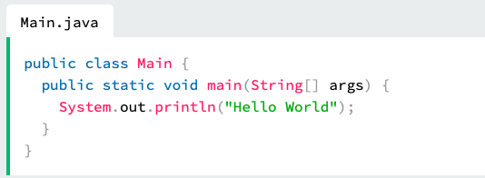

# Get Started With Java

At W3Schools, you can try Java without installing anything.

Our Online Java Editor runs directly in your browser, and shows both the code and the result:

**Code:**
 

public class Main {
 &nbsp;&nbsp;&nbsp;&nbsp;&nbsp;&nbsp;
public static void main(String[] args) {
 &nbsp;&nbsp;&nbsp;&nbsp;&nbsp;&nbsp;&nbsp;&nbsp;&nbsp;&nbsp;&nbsp;&nbsp;System.out.println("Hello World");
 &nbsp;&nbsp;&nbsp;&nbsp;&nbsp;&nbsp;
}
 
}

# Java Install
However, if you want to run Java on your own computer, follow the instructions below.

Some PCs might have Java already installed.

To check if you have Java installed on a Windows PC, search in the start bar for Java or type the following in Command Prompt (cmd.exe):

C:\Users\Your Name>java -version 

If Java is installed, you will see something like this (depending on version):

java version "22.0.0" 2024-08-21 LTS
Java(TM) SE Runtime Environment 22.9 (build 22.0.0+13-LTS)
Java HotSpot(TM) 64-Bit Server VM 22.9 (build 22.0.0+13-LTS, mixed mode)

If you do not have Java installed on your computer, you can download it at oracle.com.

**Note**: In this tutorial, we will write Java code in a text editor. However, it is possible to write Java in an Integrated Development Environment, such as IntelliJ IDEA, Netbeans or Eclipse, which are particularly useful when managing larger collections of Java files.

# Java Quickstart

In Java, every application begins with a class name, and that class must match the filename.

Let's create our first Java file, called Main.java,  which can be done in any text editor (like Notepad).

The file should contain a "Hello World" message, which is written with the following code:

Don't worry if you don't understand the code above - we will discuss it in detail in later chapters. For now, focus on how to run the code above.

Save the code in Notepad as "Main.java". Open Command Prompt (cmd.exe), navigate to the directory where you saved your file, and type "javac Main.java":

C:\Users\Your Name>javac Main.java

This will compile your code. If there are no errors in the code, the command prompt will take you to the next line. Now, type "java Main" to run the file:

C:\Users\Your Name>java Main

The output should read:

Hello World

